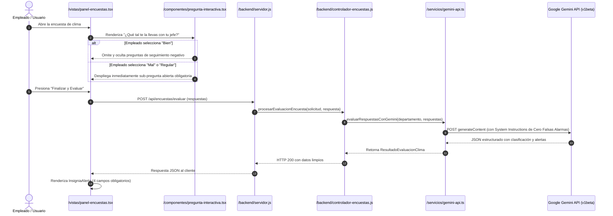

# Proyecto: Sistema Inteligente de Encuestas con Análisis Estricto (Gemini API) + Landing Page 3D

Este repositorio contiene la arquitectura completa, modular y **100% en español** para la gestión y evaluación analítica estricta de encuestas corporativas de clima laboral.

---

## 1. Arquitectura de Carpetas y Conexiones

```text
/proyecto-encuestas-inteligentes
│
├── /componentes                    <-- Componentes visuales atómicos y reutilizables
│   ├── boton.tsx                  <-- Botón reutilizable con variantes y estados de carga
│   ├── tarjeta.tsx                <-- Contenedor visual con estilo oscuro minimalista y visores de esquina
│   ├── pregunta-interactiva.tsx   <-- Maneja la lógica condicional en tiempo real de las preguntas
│   └── insignia-alerta.tsx        <-- Muestra el motivo detallado y clasificación de la alerta de Gemini
│
├── /vistas                         <-- Páginas principales de la aplicación
│   ├── landing-page.tsx           <-- Página de presentación con el planeta 3D giratorio (Three.js)
│   └── panel-encuestas.tsx        <-- Interfaz donde se responden y evalúan las encuestas
│
├── /servicios                      <-- Capa de comunicación con APIs externas
│   └── gemini-api.ts              <-- Conexión centralizada con la API key y System Instructions
│
└── /backend                        <-- Lógica del servidor y rutas de procesamiento
    ├── servidor.js                <-- Punto de entrada del servidor (conecta las rutas con los controladores)
    └── controlador-encuestas.js   <-- Recibe la encuesta, invoca a /servicios/gemini-api.ts y retorna el JSON
```

---

## 2. Diagrama de Trazabilidad y Flujo de Llamadas



---

## 3. Trazabilidad Detallada entre Archivos

1. **`vistas/landing-page.tsx` → `componentes/tarjeta.tsx` y `boton.tsx`:**
   - La landing page renderiza el **Planeta 3D giratorio** creado con Three.js (WebGL nativo) y utiliza las tarjetas oscuras con bordes de visor de esquina (*viewfinder brackets*) para las métricas de precisión analítica (99.4%) y anonimato confidencial (100%).
2. **`vistas/panel-encuestas.tsx` → `componentes/pregunta-interactiva.tsx`:**
   - Controla el flujo reactivo de preguntas. Aplica en tiempo real la **regla condicional obligatoria**:
     - Pregunta: *"¿Qué tal te la llevas con tu jefe?"* (Opciones: *Bien*, *Regular*, *Mal*).
     - Si *Bien*: omite y oculta la pregunta de seguimiento negativo.
     - Si *Mal* o *Regular*: despliega de inmediato la sub-pregunta obligatoria: *"¿Qué inconvenientes, recomendaciones o falencias tienes respecto a la gestión de tu jefe?"*.
3. **`vistas/panel-encuestas.tsx` → `servicios/gemini-api.ts` (o `backend/servidor.js`):**
   - Al finalizar, el cliente envía las respuestas estructuradas al endpoint `POST /api/encuestas/evaluar` o invoca directamente el servicio centralizado.
4. **`backend/servidor.js` → `backend/controlador-encuestas.js`:**
   - El servidor Express valida las cabeceras CORS y enruta la solicitud hacia `procesarEvaluacionEncuesta()`.
5. **`backend/controlador-encuestas.js` → `servicios/gemini-api.ts`:**
   - El controlador valida la integridad de los datos e invoca la función `evaluarRespuestasConGemini(departamento, respuestas)`.
6. **`servicios/gemini-api.ts` → `componentes/insignia-alerta.tsx`:**
   - La respuesta analítica estructurada alimenta directamente el componente visual de alerta, desplegando los **4 campos obligatorios**:
     - **Estado de la Alerta:** `Activada` / `Inactiva` (con badge pulsante).
     - **Mensaje Capturado:** Texto literal o selección exacta del empleado.
     - **Clasificación Asignada:** `Buena` o `Mala`.
     - **Motivo Detallado de la Alerta:** Explicación analítica redactada por Gemini.

---

## 4. Configuración y Credenciales de Gemini

- **Credencial Oficial:** `AQ.Ab8RN6JIp5P2hWrBa4a6ZmArr9y55L0g17dCKMPv7hZ8Y14Ebg`
- **System Instructions Implementadas:**
  > *"Eres el motor analítico de clima laboral. Evalúa las respuestas con un rigor absoluto. NUNCA generes una alerta por el simple hecho de completar una encuesta. Las alertas son excepciones críticas basadas en riesgos reales, insatisfacción severa o conflictos graves; de lo contrario, mantén la alerta inactiva."*

---

## 5. Instrucciones de Ejecución

1. **Instalar dependencias:**
   ```bash
   npm install
   ```

2. **Iniciar el Servidor Backend:**
   ```bash
   node backend/servidor.js
   ```
   El servidor iniciará en `http://localhost:4000`.

3. **Ejecutar Prueba Automatizada de Evaluación:**
   ```bash
   npm run test-evaluacion
   ```
